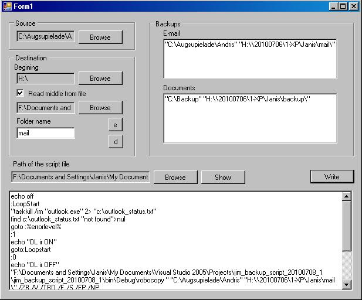
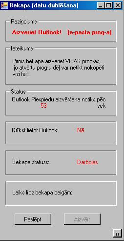

# VB script for backing up documents and e-mail.
Was specially created for clients that were rarely in the office and their data
 needed to be backed-up to the local server. The task could not be scheduled so a 
user-friendly interface and data reliable solution were required.
 
## There are 2 interfaces
1. Admin panel where You configure paths where is stored documents and e-mails and 
where should they be copied to.

2. Client panel where you see the progress - displays what is currently being 
copied and the remaining time also informs if you can use the Outlook.

## Dependencies
Uses `robocopy` tool for the file copying.

## Environment
Last time I checked was in 2011 and it worked in Windows XP and was specially
 adjusted to work with the Microsoft Outlook (closes it if it's working, so no
 data would be lost).

--------------------------------------------------------------------------------------------------------------------

Created back in 2010 when I was working as a Network Administrator / Web developer.